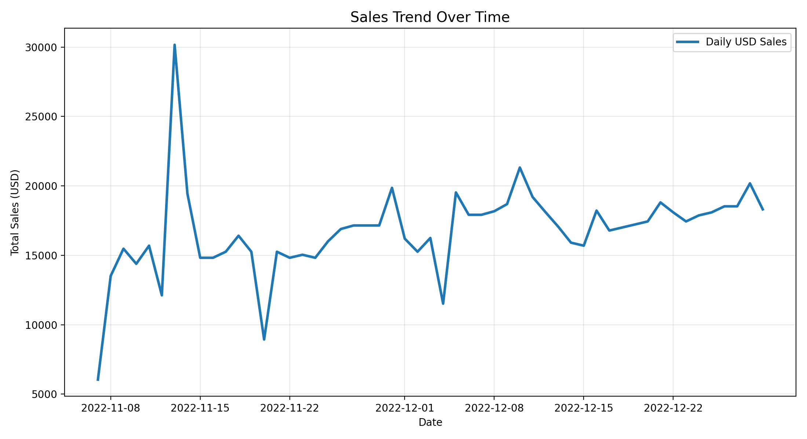
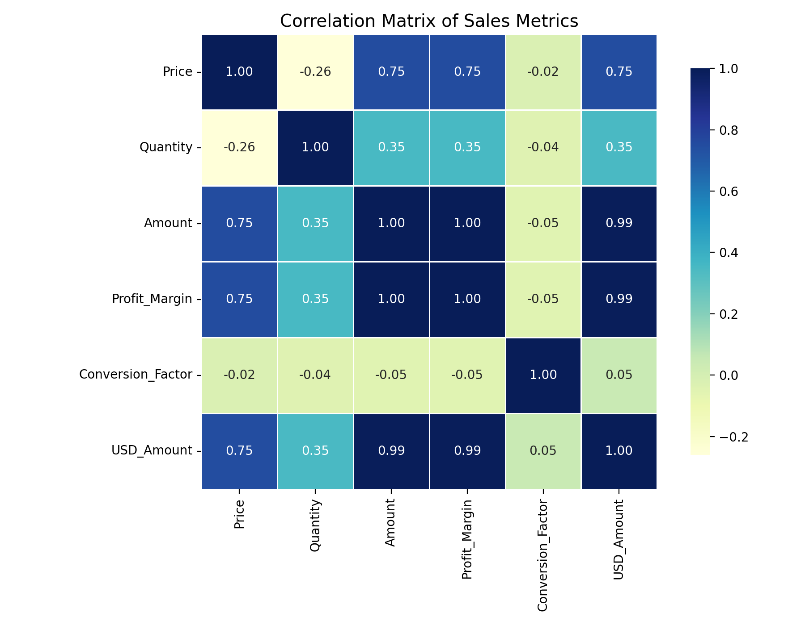

# E-Commerce Analytics Pipeline


A production-style end-to-end Python data engineering and analytics pipeline for validating, processing, modeling, analyzing, and visualizing e-commerce transaction data.

---

## Features

* Raw transaction validation and cleaning
* Robust file handling with exception management
* Object-oriented transaction modeling with inheritance
* Vectorized feature engineering using Pandas and NumPy
* Currency normalization and sales aggregation
* Static and interactive visualization reporting
* CLI entrypoint for orchestrating the full pipeline
* Centralized configuration management via `config.yaml`
* Unit testing for validation logic

---

## Tech Stack

* Python
* Pandas
* NumPy
* Matplotlib
* Seaborn
* Plotly

---

## Pipeline Architecture

```text
Raw Data
→ Validation
→ File Processing
→ OOP Modeling
→ Data Analysis
→ Visualization & Reporting
```

---

## Dataset

The original `Sales-Data-Analysis.csv` dataset was sourced from [Kaggle](https://www.kaggle.com/datasets/rohitgrewal/restaurant-sales-data) and is not included in this repository due to licensing and/or size considerations.

---

## Sample Outputs

### Sales Trend



### Correlation Matrix



---

## Getting Started

### 1. Install Dependencies

```bash
pip install -r requirements.txt
```

### 2. Run the Full Pipeline

```bash
python main.py --run-all
```

---

## Project Structure

```plaintext
ecommerce-analytics-pipeline/
├── data/
├── reports/
├── src/
├── tests/
├── config.yaml
├── main.py
├── README.md
└── requirements.txt
```
